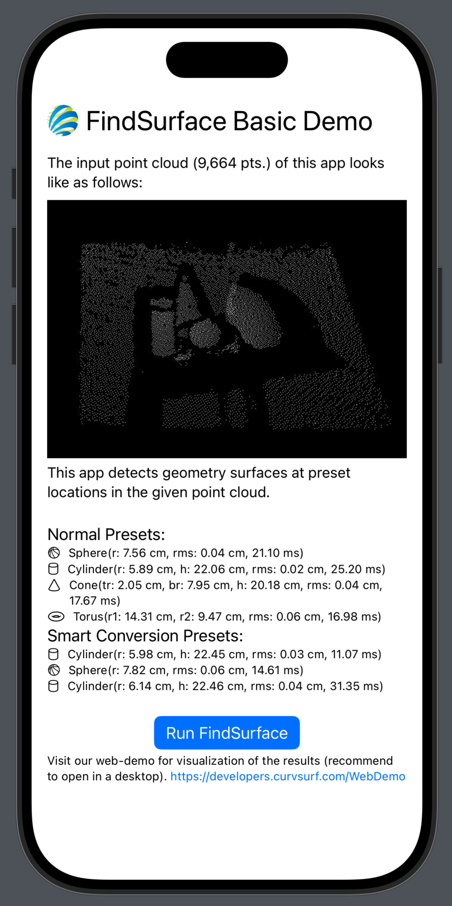

# FindSurface-BasicDemo-iOS (Swift)
**Curv*Surf* FindSurface™** BasicDemo for iOS (Swift)

## Overview

This sample source code demonstrates the basic usage of FindSurface for a simple task, which attempts to search for specific geometry shapes in a pre-defined point cloud data. (i.e., it performs the minimal tests to check if FindSurface is working properly on your device.)

You will see the following content in this app:

## [FindSurface Library Package]()

Unlike the older version of this demo, you don't need to download or setup the binary path for your project since the library is provided as a Swift package.

## About the point cloud

The point cloud in this demo is the same as the sample used in FindSurface WebDemo. Please refer to the [WebDemo](https://developers.curvsurf.com/WebDemo/) for a visual representation of FindSurface's results.

